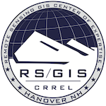

================================================================================
USGS 3DEP LiDAR Point Clouds
================================================================================

.. contents:: Contents
   :depth: 2

Support
--------------------------------------------------------------------------------

Thank you to the multiple organizations that have supported the development of
the USGS 3DEP LiDAR dataset.

USACE CRREL
................................................................................

The US Army Corps of Engineers Remote Sensing / GIS Center of Expertise at
`CRREL`_ sponsored the processing and development of the `AWS 3DEP Public Dataset`_
in multiple ways. First, it sponsored the development and continuing support of `PDAL`_ and `Entwine`_
open source software libraries, which were used to process and manage the data. Second,
it supported the processing and management of the 3DEP data to an `Entwine Point Tiles`_
public dataset.

Amazon Web Services Public Datasets Team
................................................................................

.. image:: https://d0.awsstatic.com/logos/powered-by-aws.png
    :target: https://registry.opendata.aws
    :width: 200px

The AWS Public Datasets Team supported the effort by providing processing and
storage grants for the development of the `EPT`_ data and ongoing support by
making access to that data publicly available.

Hobu, Inc.
................................................................................

`Connor Manning`_ from `Hobu, Inc.`_ constructed the 3DEP EPT resources with
cloud processing and management tools from `Hobu, Inc.`_.

.. _`Connor Manning`: http://github.com/connormanning/
.. _`Hobu, Inc.`: https://hobu.co
.. _`Entwine`: https://entwine.io
.. _`PDAL`: https://pdal.io
.. _`CRREL`: https://www.erdc.usace.army.mil/Locations/CRREL.aspx

.. _`Entwine Point Tiles`: https://entwine.io/entwine-point-tile.html
.. _`EPT`: https://entwine.io/entwine-point-tile.html

.. _`AWS 3DEP Public Dataset`: https://registry.opendata.aws/usgs-lidar/
